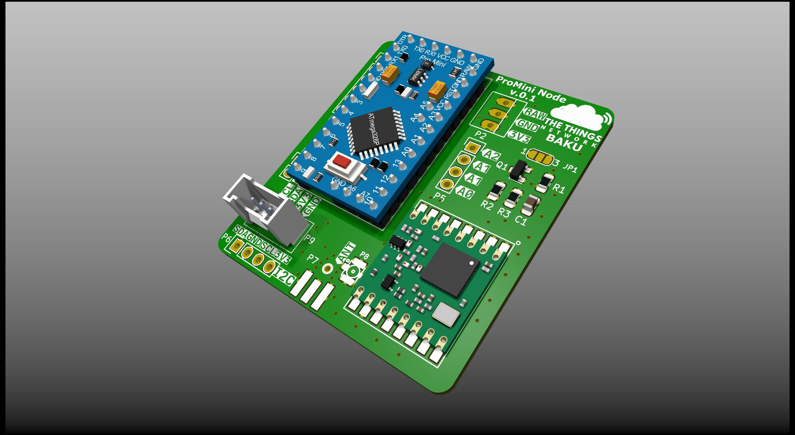
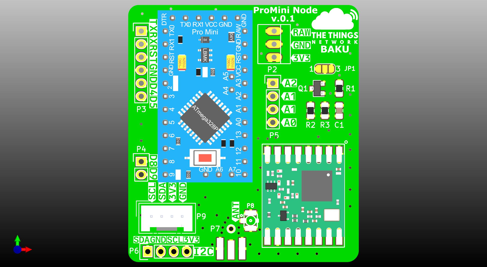
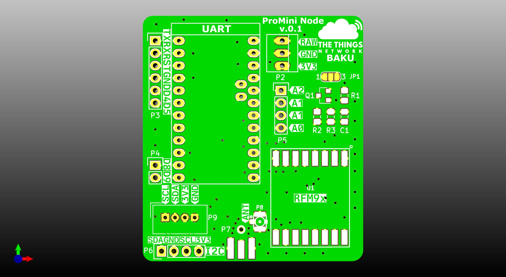

# ProMini LoRaWAN Node
A LoRaWAN node based on the Arduino ProMini and the RFM95 LoRa module. Based on the original design by [Doug Larue](https://github.com/dlarue/KiCAD/tree/master/ProMini-LoRaWAN-node), but with some additional options:

* u.FL antenna connector
* Grove connector for I2C (can also be used for analog or digital signals)
* Voltage divider circuitry to measure battery voltage
* Added silkscreen labels
* Improved layout

## Parts
* Arduino Pro Mini 3.3V, 8 Mhz
* RFM95W LoRa SX1276 module (frequency band based on your location preference, default EU868 MHz)
* Pin headers
* 4P Grove connector
* BSS84P P-Channel Mosfet Transistor SOT-23 SMD
* 0805 SMD Resistors and Capacitors (2x100K, 1x470K, 1x100nF)
* Wire-antenna of correct length (86mm for EU868) or edge-mounted SMA connector (e.g. [this part](https://www.digikey.com/product-detail/en/rf-solutions/CON-SMA-EDGE-S/CON-SMA-EDGE-S-ND/5845767)) or 

## Additional information
* Board can be powered directly from 2 AA batteries to the 3.3V input
* Use this modified [LoRaWAN stack](https://github.com/azerimaker/arduino-lmic) for low memory footprint
* Online [interactive BOM viewer](https://htmlpreview.github.io/?https://github.com/azerimaker/promini-node/blob/master/hardware/bom/ibom.html)
* [Tutorial using this board by Frank Beks](https://www.thethingsnetwork.org/labs/story/creating-a-ttn-node)

## License
* Licensed under Creative Commons Attribution-ShareAlike 4.0 Unported License (CC BY-SA 4.0)
* Original work by [Doug Larue](https://github.com/dlarue)
* Modifications by [Severin Schols](https://github.com/tiefpunkt)
* Further modifications by [Orkhan Amiraslan](https://github.com/azerimaker)
